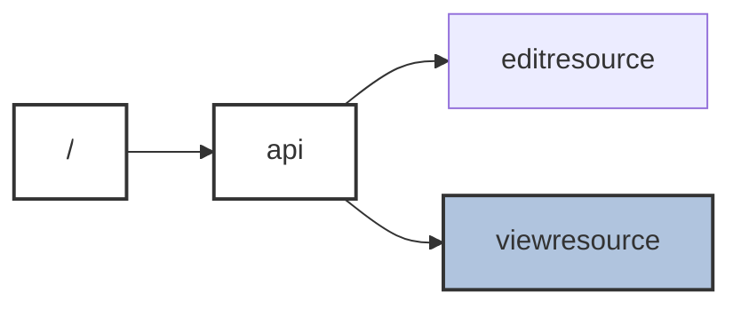

# OpenAPI to Mermaid

Powershell script that generates Mermaid diagrams from OpenApi documents

## Usage

Prerequsites:

-   .Net 7 SDK or later

Usage:

-   Clone the repo
-   Copy the OpenAPI json or yaml documents to the same directory as the script
-   Run the script

## Example

The following OpenAPI document:

```yaml
openapi: 3.0.0
info:
    title: Sample OpenApi
    version: 1.0.0
paths:
    /api/editresource:
        get:
            responses:
                "200":
                    description: OK
        patch:
            responses:
                "200":
                    description: OK
    /api/viewresource:
        get:
            responses:
                "200":
                    description: OK
```

Will generate the following Mermaid diagram:


