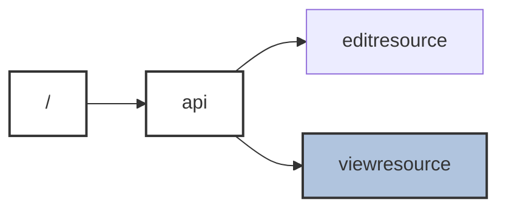

# Sample OpenApi

```mermaid
graph LR
classDef GET fill:lightSteelBlue,stroke:#333,stroke-width:2px
classDef POST fill:Lightcoral,stroke:#333,stroke-width:2px
classDef GET_POST fill:forestGreen,stroke:#333,stroke-width:2px
classDef DELETE_GET_PATCH fill:yellowGreen,stroke:#333,stroke-width:2px
classDef DELETE_GET_PATCH_PUT fill:oliveDrab,stroke:#333,stroke-width:2px
classDef DELETE_GET_PUT fill:olive,stroke:#333,stroke-width:2px
classDef DELETE_GET fill:DarkSeaGreen,stroke:#333,stroke-width:2px
classDef DELETE fill:Tomato,stroke:#333,stroke-width:2px
classDef OTHER fill:White,stroke:#333,stroke-width:2px
/["/"] --> /api["api"]
/api["api"] --> /api/editresource["editresource"]
class /api/editresource GET_PATCH
/api["api"] --> /api/viewresource["viewresource"]
class /api/viewresource GET
class /api OTHER
class / OTHER
```
